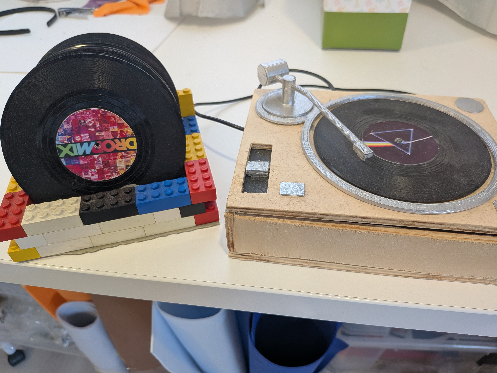

"Minilos" (or "minyls") is an attempt to adapt the experience of owning and playing vinyl records to the digital age.

NFC-enabled mini-vynils are read with a raspberry-pi-powered record-player, which reads the album from the NFC chip and plays it on spotify using their REST API.


### Requirements

- A raspberry pi
- An MFRC522 NFC reader, plus NFC tags
- A spotify premium account (otherwise you can't use the API)

### Installation and setup

First, hook up the NFC reader to your Rpi. An image with the pinout is included on on `NFC_MFRC522_RPI.png`.

Note: for the following steps you'll need _python2_ and _pip_.

To install the dependencies: 

`pip install -r requirements.txt`

Then make a copy of the sample config files:

```
cp album_mapping.sample.py album_mapping.py
cp spotify_keys.sample.py spotify_keys.py
```

And you should now be ready to run the program:

`python main.py`


### References

We're using an MFRC522 NFC reader, and using the following library: https://github.com/pimylifeup/MFRC522-python.

We're using the spotify API https://developer.spotify.com/documentation/web-api/reference/player/

Spotify AUTH guide https://developer.spotify.com/documentation/general/guides/authorization-guide/

Spotify APP dashboard https://developer.spotify.com/dashboard/applications


### How to authenticate

First run ` export FLASK_APP=spotify_auth.py ; flask run --host=0.0.0.0` 
then click on the `/authorize` endpoint that will appear on the console 
This will take you to a browser where you can login
The callback will request a final token for your user
Copy the `refresh_token` in a new variable in `spotify_keys.py` file
This refresh token will be used to get a brand new auth_token everytime you make a request.

### Personalize your minilos

The file `album_mapping.py` contains a mapping from NFC tag IDs to spotify album/playlist/song URIs. Add your own!

Use the `cover.xcf` template to create tag images for your minilos, using GIMP.
